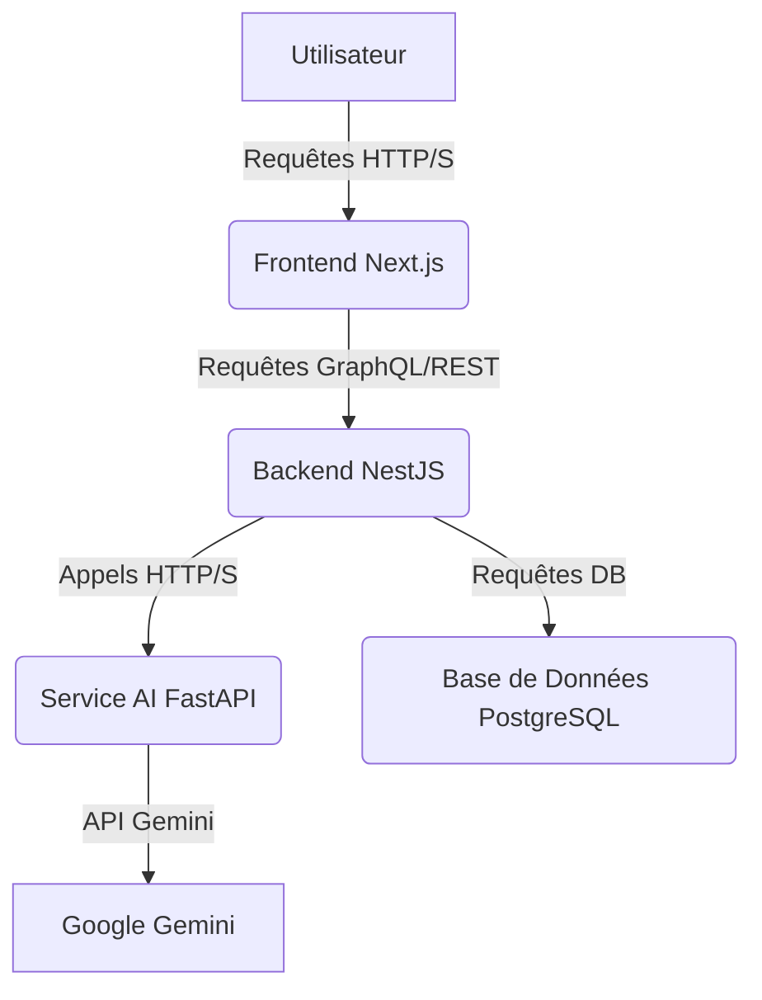

# Plan de Migration AI4Local : Next.js et NestJS

Ce document détaille le plan de migration de l'architecture actuelle du projet AI4Local (Frontend React/Vite, Backend Flask) vers une nouvelle stack technologique basée sur Next.js pour le frontend et NestJS pour le backend. L'intégration GraphQL et Gemini sera maintenue et adaptée à cette nouvelle architecture.

## 1. Contexte et Objectifs de la Migration

### 1.1. Contexte Actuel
Le projet AI4Local est actuellement structuré avec un frontend développé en React (Vite), un backend API en Flask utilisant SQLAlchemy pour la base de données SQLite, et un service d'IA séparé en FastAPI intégrant Google Gemini. L'API backend a récemment été mise à jour pour supporter GraphQL en plus de REST.

### 1.2. Raisons de la Migration
La décision de migrer vers Next.js et NestJS est motivée par plusieurs facteurs stratégiques et techniques :

*   **Performance et SEO (Next.js)** : Next.js offre des capacités de rendu côté serveur (SSR), de génération de sites statiques (SSG) et de rendu incrémental statique (ISR) qui améliorent considérablement les performances de chargement initial et l'optimisation pour les moteurs de recherche (SEO), cruciaux pour une application web orientée marketing.
*   **Développement Full-Stack Unifié (Next.js)** : Next.js permet de gérer à la fois le frontend et une partie du backend (API Routes, Server Components) au sein du même projet, simplifiant la gestion des dépendances et le déploiement.
*   **Scalabilité et Robustesse (NestJS)** : NestJS est un framework Node.js progressif pour la construction d'applications côté serveur efficaces, fiables et évolutives. Il est construit avec TypeScript et combine des éléments d'OOP, de Programmation Fonctionnelle et de Programmation Réactive. Son architecture modulaire et son support natif pour GraphQL en font un choix idéal pour une API backend complexe et maintenable.
*   **Productivité des Développeurs** : L'écosystème TypeScript de NestJS et les conventions de Next.js peuvent améliorer la productivité à long terme, la maintenabilité du code et la collaboration en équipe.
*   **Standardisation** : L'adoption de frameworks plus structurés et largement adoptés dans l'industrie (Next.js, NestJS) facilite le recrutement et l'intégration de nouveaux développeurs.

### 1.3. Objectifs de la Migration
Les objectifs principaux de cette migration sont :

*   Améliorer les performances et l'expérience utilisateur du frontend.
*   Renforcer la robustesse, la scalabilité et la maintenabilité de l'API backend.
*   Maintenir l'intégration existante avec le service AI (FastAPI/Gemini).
*   Assurer une transition fluide avec un minimum d'interruption de service (pour un projet en production).
*   Pousser le projet mis à jour vers un nouveau dépôt GitHub.

## 2. Architecture Cible

L'architecture cible du projet AI4Local après migration sera la suivante :

*   **Frontend** : Next.js (avec React, TypeScript, Tailwind CSS, shadcn/ui)
*   **Backend API** : NestJS (avec TypeScript, GraphQL, TypeORM/Prisma pour la base de données)
*   **Service AI** : FastAPI (Python, Gemini) - *inchangé, mais les appels seront faits depuis NestJS*
*   **Base de Données** : PostgreSQL (recommandé pour NestJS/TypeORM/Prisma) ou SQLite pour le développement local.

## 3. Plan de Migration Détaillé par Phase

### Phase 1: Analyse et Planification (Actuelle)

*   **Recherche approfondie** sur les meilleures pratiques de migration React vers Next.js et Flask vers NestJS.
*   **Évaluation des bibliothèques GraphQL** pour NestJS (ex: `@nestjs/graphql` avec Apollo ou Mercurius).
*   **Décision sur l'ORM/ODM** pour NestJS (TypeORM ou Prisma).
*   **Définition des modèles de données** pour NestJS en TypeScript.
*   **Mise à jour du fichier `todo.md`** avec les tâches détaillées de chaque phase.

### Phase 2: Mise à jour du Frontend vers Next.js

*   **Initialisation d'un nouveau projet Next.js** avec TypeScript et Tailwind CSS.
*   **Migration des composants React existants** (`apps/frontend/src/App.jsx`, `components/ui/*`) vers la structure Next.js (pages, `app` directory, composants).
*   **Adaptation du style** : S'assurer que Tailwind CSS fonctionne correctement avec Next.js.
*   **Configuration du client GraphQL** (ex: Apollo Client) pour Next.js.
*   **Test du frontend** de manière isolée.

### Phase 3: Mise à jour du Backend vers NestJS

*   **Initialisation d'un nouveau projet NestJS** avec TypeScript.
*   **Installation des dépendances GraphQL** (`@nestjs/graphql`, `apollo-server-express`).
*   **Définition des schémas GraphQL** (types, requêtes, mutations) en utilisant les décorateurs NestJS.
*   **Migration des modèles de données** (User, Organization, Customer, Campaign) vers des entités TypeORM/Prisma.
*   **Implémentation des services et contrôleurs** pour gérer la logique métier et les interactions avec la base de données.
*   **Intégration du service AI (FastAPI)** : Créer un module NestJS pour appeler le service FastAPI.
*   **Migration de la logique d'authentification JWT** vers NestJS (stratégies Passport.js).
*   **Test du backend** de manière isolée.

### Phase 4: Intégration Frontend-Backend

*   **Mise à jour des appels API** dans le frontend Next.js pour consommer l'API GraphQL de NestJS.
*   **Gestion de l'authentification** : Implémenter le flux d'authentification (login/signup) entre le frontend et le backend.
*   **Adaptation des formulaires et des vues** pour correspondre aux nouvelles structures de données GraphQL.
*   **Développement des fonctionnalités manquantes** ou adaptation des fonctionnalités existantes (gestion des clients, campagnes, etc.) pour la nouvelle stack.

### Phase 5: Tests d'Intégration et Validation

*   **Tests unitaires et d'intégration** pour les modules Next.js et NestJS.
*   **Tests de bout en bout** pour valider le flux complet de l'application (inscription, connexion, création de client, création de campagne, génération IA).
*   **Tests de performance** pour s'assurer que la nouvelle stack apporte les améliorations attendues.
*   **Tests de sécurité** (JWT, CORS, validation des entrées).

### Phase 6: Mise à jour de la Documentation

*   **Mise à jour du `README.md`** avec les nouvelles instructions de démarrage pour Next.js et NestJS.
*   **Mise à jour du `DEPLOYMENT.md`** pour refléter les nouvelles procédures de déploiement (Vercel/Netlify pour le frontend, Render/Fly.io pour le backend).
*   **Création d'une documentation GraphQL** spécifique pour NestJS (schéma, exemples de requêtes/mutations).
*   **Mise à jour du `USER_GUIDE.md`** si des changements majeurs affectent l'expérience utilisateur.

### Phase 7: Push vers GitHub

*   **Création d'un nouveau dépôt GitHub** pour la nouvelle version du projet.
*   **Pousser tout le code source** vers ce nouveau dépôt.
*   **Fournir un résumé** des changements et des améliorations à l'utilisateur.

## 4. Outils et Dépendances Clés

### Frontend (Next.js)
*   **Framework** : Next.js
*   **Langage** : TypeScript
*   **UI** : React, Tailwind CSS, shadcn/ui
*   **Client GraphQL** : Apollo Client ou React Query

### Backend (NestJS)
*   **Framework** : NestJS
*   **Langage** : TypeScript
*   **GraphQL** : `@nestjs/graphql` (avec Apollo ou Mercurius)
*   **ORM** : TypeORM ou Prisma
*   **Authentification** : Passport.js, JWT

### Service AI (FastAPI)
*   **Framework** : FastAPI
*   **Langage** : Python
*   **Modèle AI** : Google Gemini

## 5. Risques et Atténuations

*   **Complexité de la migration** : La migration d'une stack à une autre est complexe. Une planification détaillée et des tests rigoureux sont essentiels.
*   **Problèmes de compatibilité** : Des problèmes peuvent survenir lors de l'intégration des différentes parties. Des tests d'intégration continus seront mis en place.
*   **Temps de développement** : Cette migration est un projet en soi et nécessitera un temps de développement significatif. Une communication régulière sur l'avancement sera maintenue.

Ce plan servira de feuille de route pour la migration. Chaque phase sera exécutée séquentiellement, avec des validations à chaque étape pour assurer la qualité et la conformité aux objectifs.

